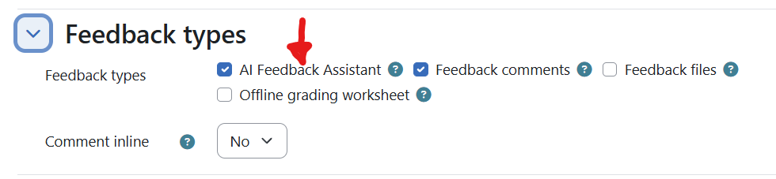
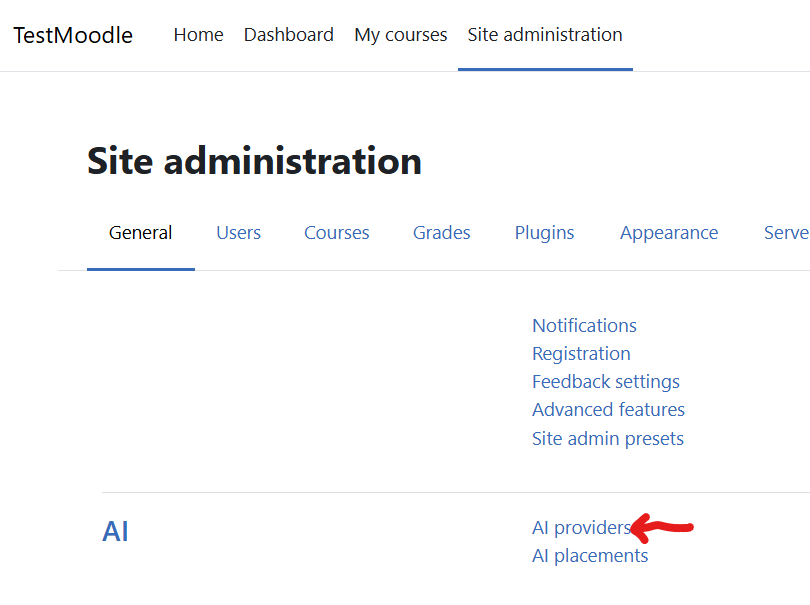
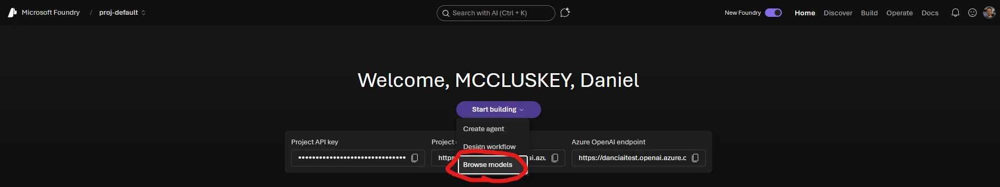
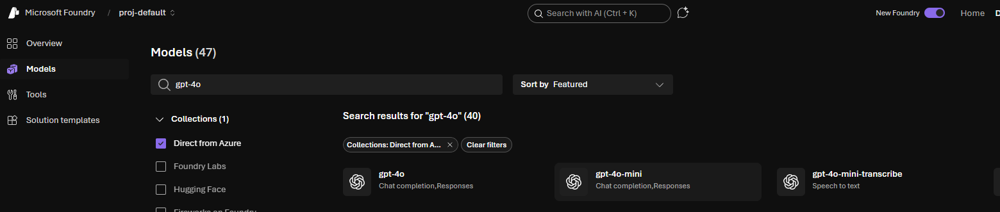
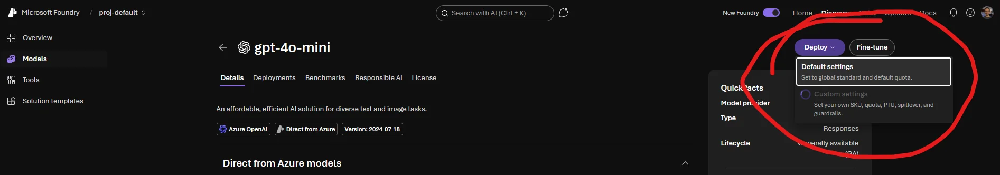
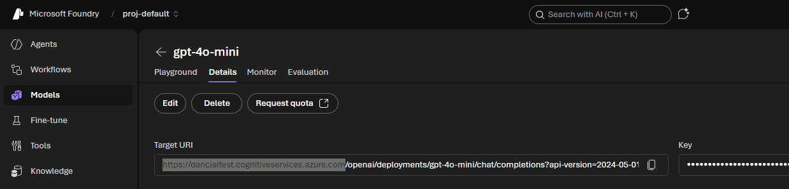
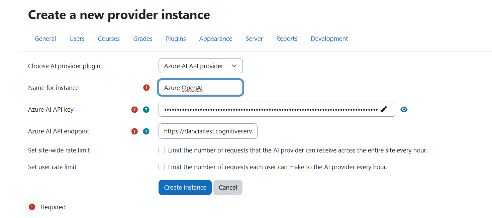
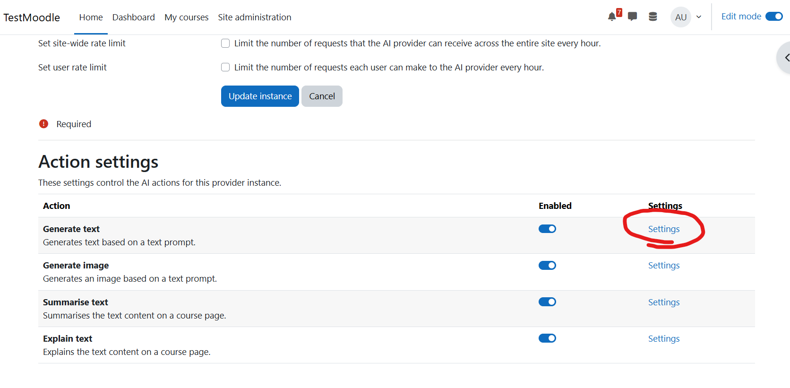
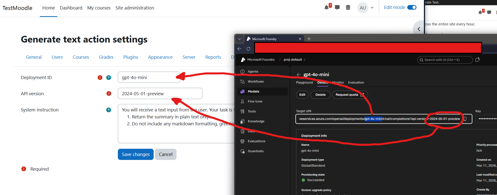

# Setup

First install the plugin to `mod/assign/feedback/aifeedback` and complete the upgrade from `Site administration > Notifications`.

## Enabling the Feedback Plugin
In any assignment instance, go to `Edit assignment > Feedback types` and enable `AI feedback assistant`. This will add the `Generate AI guidance` action to the grading screen.

## AI Provider Setup
To use this plugin you must have at least one Moodle AI provider configured that supports text generation. These providers are configured at `Site administration > AI > AI providers`. You can use any provider that supports text generation, but the guide below uses the Microsoft Azure OpenAI provider as an example for setup and configuration.

### Microsoft Azure OpenAI Setup
1. Create an Azure Foundry account at the following link: https://ai.azure.com/
2. Click "Start Building" and select "Browse Models"
   

3. Select a model that you wish to use that has both Chat Completion and Responses, for this example we are going to use `gpt-40-mini`
   

   ***IMPORTANT NOTE:*** The model you select must not have a full stop in the name, otherwise Moodle will not be able to use it. For example, `gpt-40-mini` is valid but `gpt-4.0-mini` is not. I will open a bug on the Moodle bug tracker for this at some point.

4. Deploy the Model with default settings and wait for the deployment to complete.
   

5. After deployment, go to the details tab and copy the base url of the "Target URI" field, for example `https://your-resource-name.cognitiveservices.azure.com`. This is also where you get your Key from.
   
   
   ***IMPORTANT NOTE:*** You must copy the base url and not the full target URI, otherwise Moodle will not be able to use it. For example, `https://your-resource-name.cognitiveservices.azure.com` is valid but `https://your-resource-name.cognitiveservices.azure.com/openai/deployments/gpt-40-mini/chat/completions?api-version=2024-06-01` is not.

6. In Moodle, go to `Site administration > AI > AI providers` and add a new provider, insert the base of the Target URI to the Azure AI API endpoint field. Then copy your key to the Azure AI API key field. Should look something like this...
   

7. Save the provider and go back into its settings. You should now see `Action Settings` when you scroll down. Go to the settings for Generate Text.
    

8. Take the deployment model name and the API Version from your Target URI and insert them into the fields like in the image below. For example, if your Target URI is `https://your-resource-name.cognitiveservices.azure.com/openai/deployments/gpt-40-mini/chat/completions?api-version=2024-06-01`, then the deployment name is `gpt-40-mini` and the API version is `2024-06-01`.
   

9. Save the settings and your provider should now be ready to use with the AI Feedback Assistant plugin.

